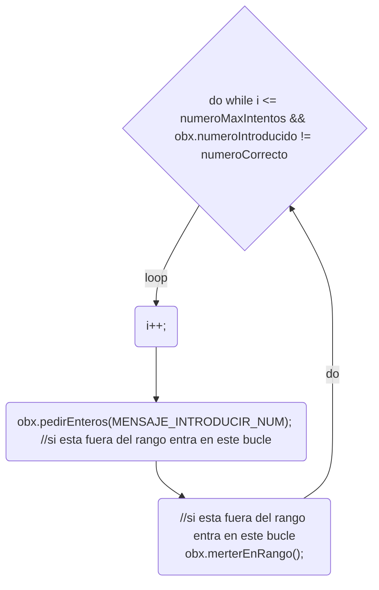

# examenDAM
Para utilizarlo en el examen

## Clonado de repositorio de Damian y pusheo repositorio remoto propio - commit 1
<ol>
<li>Me muevo en por la bash</li>
Con el comando 'cd nombreRepositorio' abro los repositorio y con 'ls -l' enlisto de manera vertical los ficheros que hay dentro del repositorio donde me encuentre. Me ubico en una carpeta llamada 'COD' que es donde voy a hacer el clone. Con el comando 'open nombreFichero' abro el readme para modificarlo.
<li>Clono el repositorio de Damian</li>
Con el comando 'git clone -o nombreRepositorio [enlaceRepoDamian](https://github.com/damiancastelao/examenDAM.git)' clono el repositorio. Con el '-o' lo que hago es ponerle un nombre para distinguir el remote de clonado del remote de pusheo que haré a más tarde.
<li>Creo repositorio en GitHub</li>
Creo un repositorio en GitHub con el nombre ['repositorioRespuestaExamen'](https://github.com/acastineiraduran/repositorioRespuestaExamen) y lo pongo en privado.
<li>Hago un commit del repositorio de Damian con este Readme modificado y lo subo a mi repositorio de GH</li>
Mediante el commando git log --oneline veo los commits hechos hasta ahora. Como aún no he hecho ninguno veo solo el commit hecho por Damian. 
Antes de subirlo cambio la rama de la 'master' a la 'main'. Con el comando 'git branch' puedo ver el tipo de rama actual y con 'git branch -M main' cambio la rama 'master' a la 'main'.
Una vez guardo los cambios hechos en el readme, con 'git status -s' puedo observar que aparece el fichero readme modificado en rojo. Con los comandos 'git add nombreFichero' y 'git commit -m "descripcionCommit"' hago una "snapshot" de los cambios hechos hasta el momento. Con 'git remote add origin [enlaceRepoPropio](https://github.com/acastineiraduran/repositorioRespuestaExamen.git)' hago el seguimiento remoto de mi repositorio local. Por último con 'git push origin main' empujo el repositorio al GitHub. Cuando lo pushee me va a crear una contraseña y un usuario. Para la contraseña tengo que crear un nuevo token en GH.
</ol>

## Añado el código a mi repositorio de GH - commit 2
<ol>
<li>Añado la carpeta src con mi codigo a la carpeta proyecto</li>
<li>Añado el repositorio 'src' y el fichero readme modificado. Después hago el commit y push de ambos archivos</li>
<li>Cambio nombre autor</li>
Los nuevos commits que voy pusheando a mi repositorio de GH se comentarán con mi usario y no con el de Damian. Esto se debe a que cuando instalamos Git por primera vez, configuramos una serie de parámetros entre los cuales se encuentra el nombre de usuario. Estos parámetros sirven principalmente para asignar un autor a los commits. Para ver los parámetros que tengo configurados usamos el comando: <b>cat .gitconfig</b>
</ol>
## Creo el diagrama de flujo y lo subo - commit 3
Con una app online copio el codigo y me crea el diagrama. Pego el código del diagrama al readme y lo subo.

