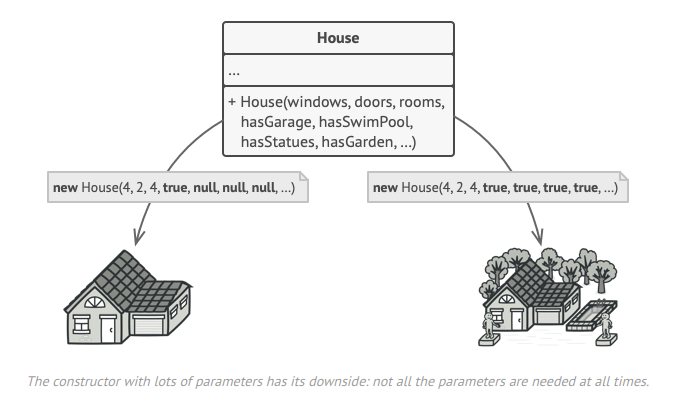
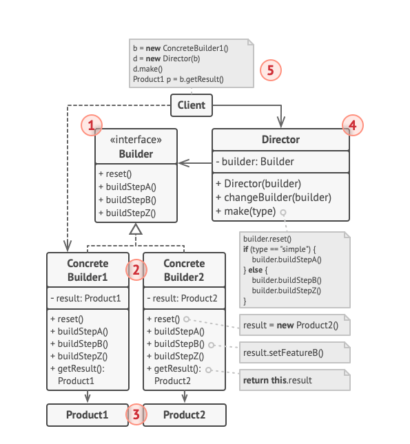

# PizzaBuilder
## Primera parte
_"Crea una aplcación que crea objeto de una clase 
 que tiene un constructor con muchisimos parametros..."_

1. Declaro el objeto de tipo `Pizzas`
al que llamamos `_pizza` para identificar
que es un objeto perteneciente a esta clase.
    ````java
    Pizzas _pizza;
    ````

2. Defino el constructor por defecto y en su
cuerpo le asigno a la variable `_pizza` el valor
de: instancia de ``Pizzas``
<a name="item2"></a>
    ````java
    public PizzaBuilder(){
    _pizza=new Pizzas();
        }
    ````
   
3. Defino el método `build()`, que es el que
va a devolver la variable ``_pizza``. 
    ````java
    public Pizzas build(){
        return this._pizza;
    }
    ````
    >En un principio, al llamar posteriormente a este método pensé
    que devolvía ``null``(ya que ``_pizza`` sólo la había
    inicializado localmente, es decir, dentro del método
    ``PizzaBuilder()``)
    pero en realidad sí devuelve el objeto
    de tipo ``Pizzas`` porque después (en la Main), para utilizar este método,
    tengo que haber creado antes una instancia de ``PizzaBuilder`` ([paso2](#item2))
    (se verá con más de detalle en la Main).

4. Creo el siguiente método (algo parecido a un ``@Override``)
en el que le asigno a el atributo ``cebolla`` de la clase
 ``Pizzas`` un nuevo valor.

   ````java
   public PizzaBuilder setCebolla(boolean cebolla){
   _pizza.setCebolla(cebolla);
   return this;
    }
   ````
   Se retorna ``this`` que es el objeto de
   esta clase.

### Main
### Instancia de pizza
Creo el objeto de tipo ``PizzaBuilder`` para utilizar los métodos
de esta clase:
`````java
Pizzas pizza=new PizzaBuilder(); // ERROR
`````
Esta forma es incorrecta ya que el constructor ``PizzaBuilder()`` **no
devuelve un objeto ``Pizzas`` si no que **únicamente lo crea**. Por tanto,
lo correcto sería:
````java
PizzaBuilder pizzaBuilder=new PizzaBuilder();
````

### Nuevos valores a los atributos de pizza
````java
Pizzas pizzaAcebollada=pizzaBuilder.setCebolla(true).build();
````
Mediante ``setCebolla(true)`` le cambio el valor al atributo
``cebolla`` y devuelvo un objeto ``Pizzas``
> Recordar que el método setCebolla() devolvía ``this``

Con ``build`` devuelvo el objeto de tipo ``Pizzas`` y por eso declaro
la variable "pizzaAcebollada" de ese tipo.

 <details><summary><h4>¿Porque puedo llamar a ``build()`` desde ``setcebolla()``
?</h4></summary>
  <p><h8>Porque ``setcebolla()`` devuelvo una instancia de ``PizzaBuilder``(``this``)
y desde ahí sí que podríamos llamar a los métodos de la clase</8></p>
</details>

-----

## Segunda parte
"_Crea una rama nueva que se llame 'builder'
Luego con este repositorio como ejemplo, 
crear tu propio builder y cambia el main en esta nueva rama, para crear 
la pizza con el builder._"

Por lo que yo entiendo es realizar los pasos anteriores pero utilizando una rama distinta llamada ``builder``.

Por lo que cree nueva rama con ``git branch`` me trasladé a ella, creé nueva clase e hice algunas implementaciones en
la Main. Finalmente hice el push de la rama.

Por último hice un ``merge --squash`` desde el IDE.

-----

## Tercera parte
### _¿Cual es la función de este patrón?_ - Examen
Builder es un patrón de diseño creativo cuya función consiste en fragmentar más el código de forma que
se construyan objetos complejos paso a paso. 
El patrón permite producir diferentes tipos y representaciones de un objeto utilizando el mismo código de construcción.

Algunos ventajas de la implementación del uso del patrón son:

* Deshacerte del "patrón telecópico"
  (para evitar crear muchos métodos métodos sobreecargados o tener que inicializar constructores muy largo cada vez que
instancio).


* Cuando quieres que tu objeto pueda ser representado de distintas maneras.


* Para construir árboles compuestos u otros objetos complejos.

 <details><summary><h4><mark>Ejemplo</mark></h4></summary>
<p><h8>
Imaginemos un objeto "casa" que tendrá muchas características (tipo paredes, numero ventanas, si tiene jardin...)
en su clase por lo que habrá que crear un método
constructor sobreecargado que inicialice todos estos atributos.



Esta sería la respuesta que parece más lógica pero en realidad es muy laboriosa
ya que tendríamos que inicializar muchos atributos antes de crear instancias

Si en vez de esto utilizamos el patrón Builder
no necesitamos llamar a todos los pasos. 
Podemos llamar solo aquellos pasos que son necesarios 
para producir una configuración particular de un objeto.

Diagrama de clases:



</h8></p>
</details>

### _¿Como es su Diagrama de clases? Realiza en el readme el diagrama_
````mermaid
classDiagram
      class Main{ 
        Pizzas pizza4Quesos
        Pizzas pizzaAcebollada
        +main()
      }
      Main "1" *-- "1..*" PizzaBuilderColab : association
      class PizzaBuilderColab{
          +build()
      }
      PizzaBuilderColab "1" *-- "1" Pizzas : association
      class Pizzas {+Pizzas()}  
      
    class PizzaBuilder{
          +build()
      }
      
      PizzaBuilder "1" *-- "1" Pizzas : association
      Main "1" *-- "1..*" PizzaBuilder : association       
````

### _¿Podríamos combinarlo con el patrón Factory?_  - Examen
Muchos diseños comienzan usando Factory
(menos complicado y más personalizable a través de subclases) 
y evolucionan hacia Abstract Factory, 
Prototype o Builder (más flexible, pero más complicado). Asi que sí, 
podemos combinarlos.

Builder se enfoca en construir objetos complejos paso a paso. 
Abstract Factory se especializa en crear familias de objetos relacionados. 
Abstract Factory devuelve el producto inmediatamente, mientras que Builder
le permite ejecutar 
algunos pasos de construcción adicionales antes de buscar el producto.

Ejemplo:
1. Creo patrón Factory como hemos hecho hasta ahora: interface y clase factoria.
2. Creo Builder también.
3. Creo clases para distintos tipos de objetos que luego se 
incorporarán a la Factory. 
4. Para crear estas clases que tienen objetos con 
distintas características hago uso del patrón builder